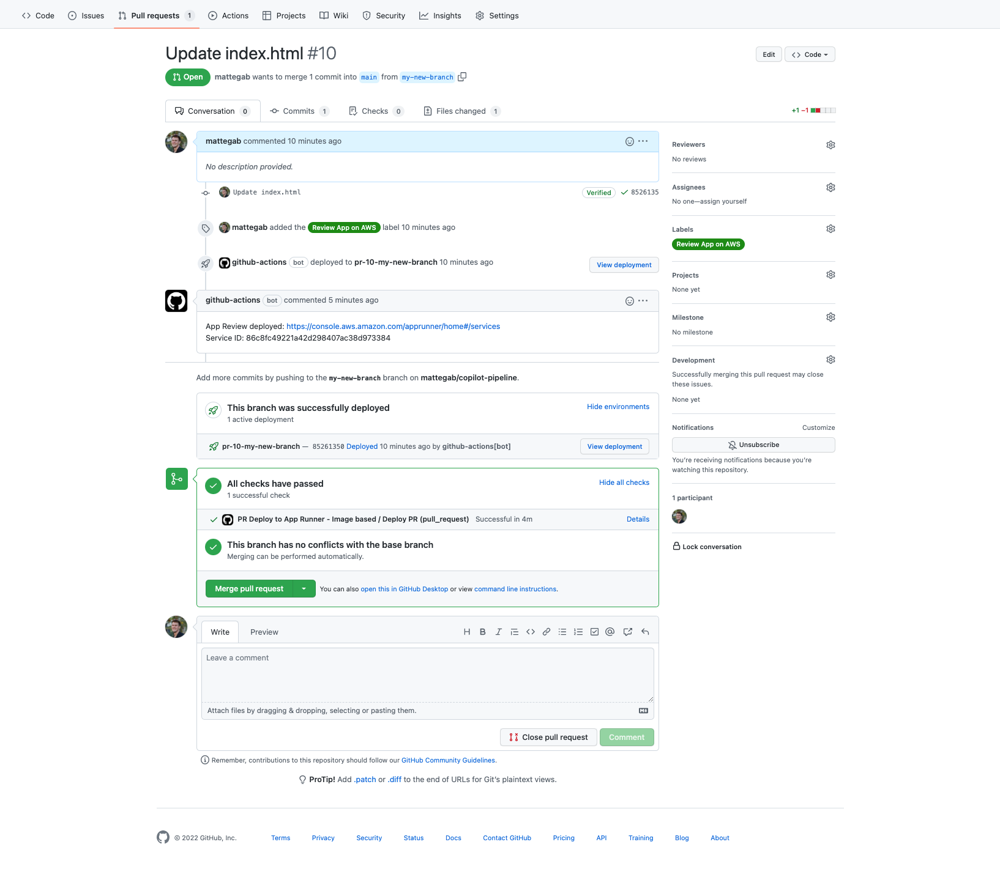

[](https://github.com/mattegab/review-apps-aws/actions/workflows/image-pipeline-push.yml)

[](https://github.com/mattegab/review-apps-aws/actions/workflows/image-pipeline-pr-deploy.yml)


# Review Apps in AWS

## Preview Environments per Pull Request in AWS App Runner with GitHub Actions

These workflows assists with providing an environment to showcase product changes.

Review apps each have a unique URL you can share, making them a great way to propose & test changes to your code base.

## Usage

1. clone this repo: ```$ git clone https://github.com/mattegab/review-apps-aws.git```

2. create a repo in your GitHub account and deploy the content cloned from this repo.

3. create trust-policy.json file with trust policy
    ```
    {
        "Version": "2012-10-17",
        "Statement": [
            {
            "Effect": "Allow",
            "Principal": {
                "Service": "build.apprunner.amazonaws.com"
            },
            "Action": "sts:AssumeRole"
            }
        ]
    }
    ```

4. create new role *app-runner-service-role* with trust-policy.json
    ```
    aws iam create-role --role-name app-runner-service-role \
    --assume-role-policy-document file://trust-policy.json
    ```

5. attach AWSAppRunnerServicePolicyForECRAccess IAM policy to app-runner-service-role IAM role.
    ```
    aws iam attach-role-policy \
    --policy-arn arn:aws:iam::aws:policy/service-role/AWSAppRunnerServicePolicyForECRAccess \
    --role-name app-runner-service-role
    ```

6. create an [OpenID Connect (OIDC) identity providers in IAM](https://docs.aws.amazon.com/IAM/latest/UserGuide/id_roles_providers_create_oidc.html#manage-oidc-provider-console). More info on this process [here](https://docs.github.com/en/actions/deployment/security-hardening-your-deployments/configuring-openid-connect-in-amazon-web-services)
    ```
    For the provider URL: Use https://token.actions.githubusercontent.com
    For the "Audience": Use sts.amazonaws.com
    ```

7. create an IAM Role called *review-apps-github-oidc-role* with *Custom trust policy*:
    ```
    {
        "Version": "2012-10-17",
        "Statement": [
            {
                "Effect": "Allow",
                "Principal": {
                    "Service": "build.apprunner.amazonaws.com",
                    "Federated": "arn:aws:iam::<your-account-id>:oidc-provider/token.actions.githubusercontent.com"
                },
                "Action": "sts:AssumeRoleWithWebIdentity",
                "Condition": {
                    "StringLike": {
                        "token.actions.githubusercontent.com:aud": "sts.amazonaws.com",
                        "token.actions.githubusercontent.com:sub": "repo:<your-org>/<your-repo>:*"
                    }
                }
            }
        ]
    }
    ```

8. create an IAM Customer managed policy *review-apps-github-oidc-policy*, then assign it to the role *review-apps-github-oidc-role*:
    ```
    {
        "Version": "2012-10-17",
        "Statement": [
            {
                "Sid": "VisualEditor0",
                "Effect": "Allow",
                "Action": "apprunner:*",
                "Resource": "*"
            },
            {
                "Sid": "VisualEditor1",
                "Effect": "Allow",
                "Action": [
                    "iam:PassRole",
                    "iam:CreateServiceLinkedRole"
                ],
                "Resource": "*"
            },
            {
                "Sid": "VisualEditor2",
                "Effect": "Allow",
                "Action": "sts:AssumeRole",
                "Resource": "arn:aws:iam::<your-account-id>:role/app-runner-service-role"
            },
            {
                "Sid": "VisualEditor3",
                "Effect": "Allow",
                "Action": [
                    "ecr:GetDownloadUrlForLayer",
                    "ecr:BatchGetImage",
                    "ecr:BatchCheckLayerAvailability",
                    "ecr:PutImage",
                    "ecr:InitiateLayerUpload",
                    "ecr:UploadLayerPart",
                    "ecr:CompleteLayerUpload",
                    "ecr:GetAuthorizationToken",
                    "ecr:CreateRepository",
                    "ecr:DescribeRepositories",
                    "ecr:PutLifecyclePolicy",
                    "ecr:SetRepositoryPolicy"
                ],
                "Resource": "*"
            }
        ]
    }
    ```

9. configure GitHub secrets within your GitHub repository, under *Settings* > *Secrets*
    ```
    AWS_ROLE_TO_ASSUME --> enter in the ARN of the IAM role *review-apps-gihub-oidc-role*
    AWS_REGION --> enter the Region where the App Runner service needs to be created (e.g. us-east-1)
    ROLE_ARN -->  enter in the ARN of the IAM role *app-runner-service-role*
    ```


10. OPTIONAL: create another Action Secret named ACTIONS_STEP_DEBUG with value *true*, [more info here](https://docs.github.com/en/actions/monitoring-and-troubleshooting-workflows/enabling-debug-logging)

11. OPTIONAL: if you want to deploy a new Service in AWS App Runner every time you push to main, decomment lines 5 & 6 of **[image-pipeline-push.yml](.github/workflows/image-pipeline-push.yml)**. 
<br/>You can always trigger the workflow manually: *GitHub repo* --> *Actions* --> *Deploy to App Runner - Image based - on push* --> *Run workflow* --> *Run workflow*

12. push changes in your GitHub repo

13. OPTIONAL: manually trigger a workflow as described in point 11

14. create a label `Review App on AWS` ([instructions here](https://docs.github.com/en/issues/using-labels-and-milestones-to-track-work/managing-labels))

15. apply the label to the Pull Request you want to deploy in App Runner with the label `Review App on AWS`, then the **[image-pipeline-pr-deploy.yml](.github/workflows/image-pipeline-pr-deploy.yml)** workflow will be automatically triggered

    

16. visit the [AWS App Runner Services page](https://console.aws.amazon.com/apprunner/home#/services) to see a list of services deployed, then click on the URL and visit the web application

17. unlabel or close the Pull Request to automatically trigger the **[image-pipeline-pr-undeploy.yml](.github/workflows/image-pipeline-pr-undeploy.yml)** workflow

    

## Next steps (optional)

Ideas:

- Using your own custom domain for the PRs: [Managing custom domain names for an App Runner service]()
- Leverage AWS Copilot and create [CI/CD pipelines using the AWS Copilot CLI](https://aws.github.io/copilot-cli/docs/concepts/pipelines/) that leverage CodePipeline

## Cleaning up

Check:

- [AWS App Runner](https://console.aws.amazon.com/apprunner/home#/services) to see Services running
- [Amazon ECR](https://console.aws.amazon.com/ecr/repositories) to see the container Repositories and Images

## Acknowledgments

Credits to:

- [Deploy applications in AWS App Runner with GitHub Actions (AWS blog)](https://aws.amazon.com/blogs/containers/deploy-applications-in-aws-app-runner-with-github-actions/)
  - [Amazon "App Runner Service Deploy" action for GitHub Actions (GitHub repo)](https://github.com/awslabs/amazon-app-runner-deploy)
- [Preview Environments per Pull Request using AWS CDK and GitHub Actions (GitHub repo)](https://github.com/jgoux/preview-environments-per-pull-request-using-aws-cdk-and-github-actions)

## Learn more

- [AWS App Runner](https://aws.amazon.com/apprunner/)
- [AWS for GitHub Actions](https://github.com/aws-actions)

## Troubleshoot

- [GitHub Status](https://www.githubstatus.com/)

## License

This library is licensed under the MIT-0 License. See the LICENSE file.
